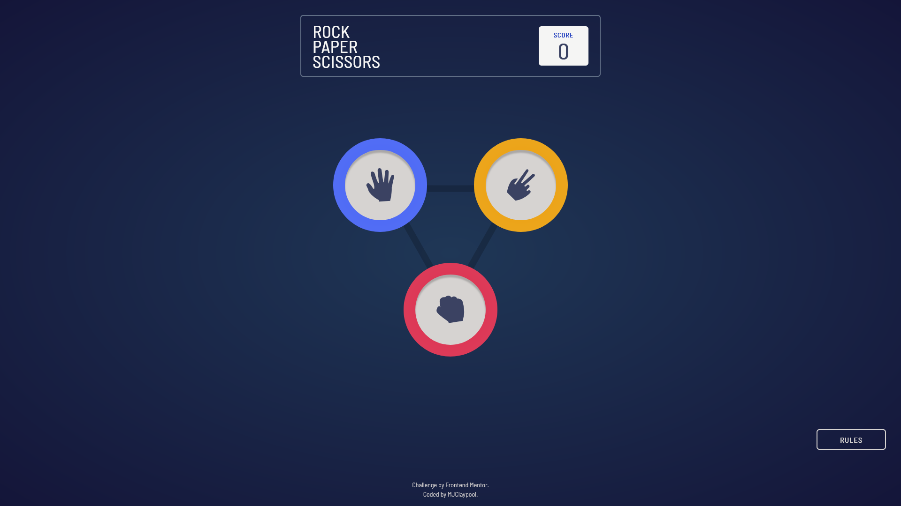
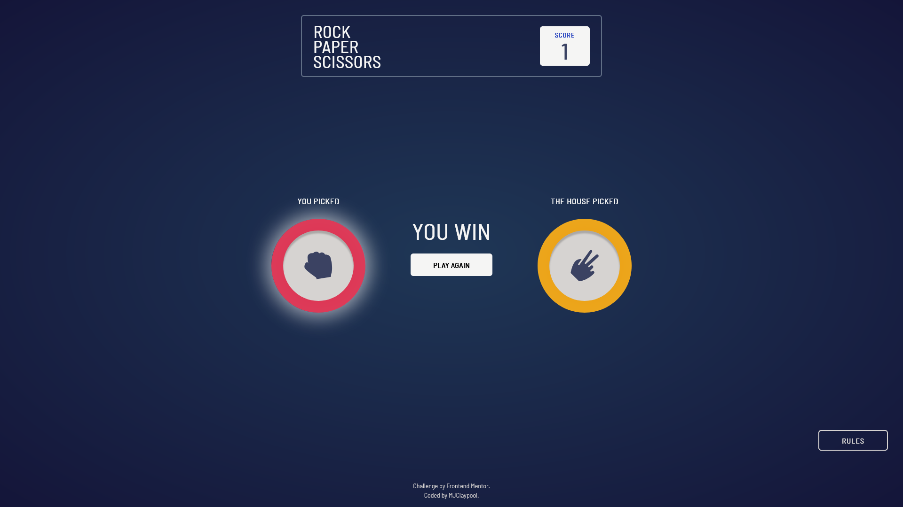
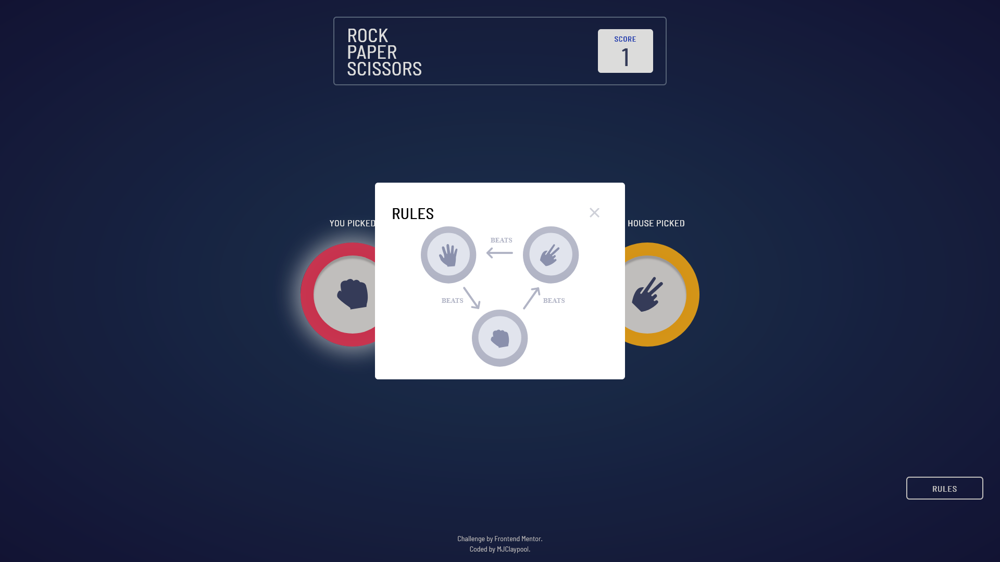

# Frontend Mentor - Rock, Paper, Scissors solution

This is a solution to the [Rock, Paper, Scissors challenge on Frontend Mentor](https://www.frontendmentor.io/challenges/rock-paper-scissors-game-pTgwgvgH). Frontend Mentor challenges help you improve your coding skills by building realistic projects.

## Table of contents

- [Overview](#overview)
  - [The challenge](#the-challenge)
  - [Screenshot](#screenshot)
  - [Links](#links)
- [My process](#my-process)
  - [Built with](#built-with)
  - [What I learned](#what-i-learned)
  - [Useful resources](#useful-resources)
- [Author](#author)


## Overview

### The challenge

Users should be able to:

- View the optimal layout for the game depending on their device's screen size
- Play Rock, Paper, Scissors against the computer
- **Bonus**: Maintain the state of the score after refreshing the browser _(optional)_
- **Bonus**: Play Rock, Paper, Scissors, Lizard, Spock against the computer _(optional)_

### Screenshot







### Links

- Solution URL: [Repository Link](https://github.com/mjclaypool/Rock-Paper-Scissors)
- Live Site URL: [Game Link](https://mjclaypool.github.io/Rock-Paper-Scissors/)

## My process

### Built with

- Semantic HTML5 markup
- CSS custom properties
- Flexbox
- Mobile-first workflow
- [React](https://reactjs.org/) - JS library
- [Tailwind CSS](https://tailwindcss.com/) - For styles
- [Framer Motion](https://www.framer.com/motion/) - For animations

### What I learned

I learned how to use motion from Framer Motion to easily create complicated animations. For this Rock-Paper-Scissors game, I animated the user's and the computer's picks to slide into frame with a spring effect, giving the animations a more natural feel than a simple A-to-B transition. Although the default spring settings were preferrable for this application, I also learned how to further tailor this animation by adjusting the stiffness and dampening parameters (effectively making the animation more or less bouncy).

```js
<motion.div
  id="user-pick"
  className="flex flex-col-reverse lg:flex-col"
  initial={{ x:-600 }}
  animate={{ x:0 }}
  transition={{ ease: "easeOut", duration: .7, type: 'spring' }}
>
  <h3 className="font-barlow font-bold text-md lg:text-lg text-stone-100 my-6">YOU PICKED</h3>
  <Button type={gameCtx.playerPick}>
    {gameCtx.result == "WIN" && <WinnerRing />}
  </Button>
</motion.div>
```

In comparison to creating the same effect with keyframes, this method for creating animations is nearly effortless yet yields highly configurable, awesome results. I look forward to learning more about Framer Motion and applying this library to future project opportunities.

### Useful resources

- [Tailwind CSS Documentation](https://tailwindcss.com/docs/installation) - This well-documented reference website helped me efficiently transition from vanilla CSS to Tailwind CSS. It is a popular CSS framework that promotes increased efficiency in styling applications.

- [Framer Motion Documentation](https://www.framer.com/motion/) - This site helped me build fun, interactive elements with ease. Recommend to anyone who finds themselves building complicated keyframe queries, or to anyone just looking to add some flair for animations and gestures.

## Author

- Website - [Mallory Claypool](https://mjclaypool.github.io/Personal-Portfolio/)
- Frontend Mentor - [@mjclaypool](https://www.frontendmentor.io/profile/mjclaypool)